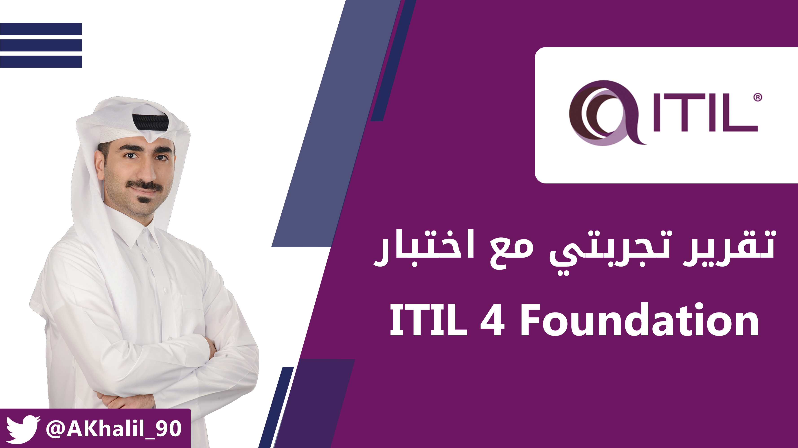
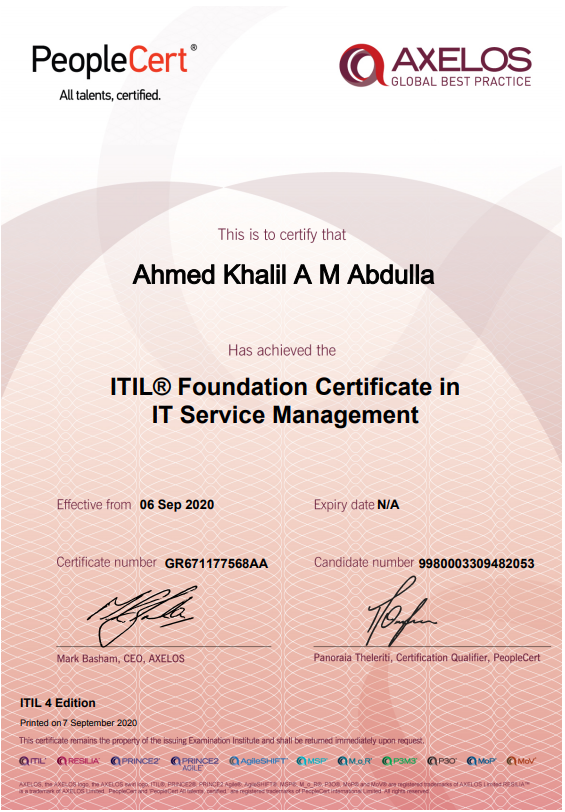

<h1 dir="rtl" align="right">تجربتي مع اختبار ITIL 4 Foundation</h1>

<h2 dir="rtl" align="right">مقدمة</h2>

ITIL وما يعرف بـ (Information Techolongy Infrastructure Library) هي بنية أو إطارية (Framework) لأفضل التطبيقات والممارسات (Best Practices) لإدارة آليات تقديم ودعم خدمات تكنولوجيا المعلومات (IT Service Management) بمنهجية وجودة عالية.

كما تعتبر شهادة (<a href="https://www.axelos.com/certifications/itil-certifications/itil-foundation">ITIL 4 Foundation</a>) الشهادة الأساسية في هذا المجال والتي تقدم من منظمة (<a href="https://www.axelos.com/">AXELOS</a>) البريطانية (نفس المنظمة التي تقدم شهادات <a href="https://www.axelos.com/best-practice-solutions/prince2">Prince2</a> المعروفة في مجال إدارة المشاريع).

هذه الشهادة ترويجا تجاريا كبيرا مقارنة بالشهادات الأخرى من نفس المجال، ولذلك تعترف بأهميتها معظم الشركات والمؤسسات، بالرغم من أنها فعليها مناسبة لمن يقوم بالبدء بمجال الأمن السيبراني والاختبار الأخلاقي.

<h2 dir="rtl" align="right">منهج اختبار ITIL 4 Foundation</h2>

يضم منهج الشهادة عدد (7) جزئيات رئيسية وهي كالتالي:

<ol dir="rtl">
<li><strong>Understand the key concepts of service management:</strong>&nbsp;تحتوي هذه الجزئية على المصطلحات الأساسية في مجال إدارة خدمات تكنولوجيا المعلومات مثل: تعريف الخدمة، التكلفة، المؤسسة، المخرجات، النتائج المرجوة، المخاطر، مقدم الخدمة، مستهلك الخدمة، وغيرها من المصطلحات الضرورية في المجال.</li>
<li><strong>Understand how the ITIL guiding principles can help an organization adopt adn adapt service management:</strong>&nbsp;هذه الجزئية تغطي عدد (7) مبادئ توجيهية يمكن لأي منظمة استخدامها كمرجه لتطوير وتحسين آلية إدارة الخدمات لديهم. أمثلة على هذه المبادئ التوجيهية: التركيز على القيمة المقدمة، البدء من الوضع الحالي، التقدم التدريجي ودراسة ردود الفعل، وغيرها.</li>
<li><strong>Understand the four dimensions of the ITIL service management:</strong> هذا المجالي يغطي عدد (4) أبعاد رئيسية وضرورية لضمان تقديم القيمة لمستهلكي الخدمة. هذها الأبعاد كالتالي: People and Organization و Information and Technology و Partners and Suppliers و Value Streams and Processes.</li>
<li><strong>Understand the purpose of the ITIL service value system:</strong> هذه الجزئية تغطي هيكيلة نظام ITIL والتي تسمى بـ (Value Service System) والتي تحتوي على (7) عناصر أساسية وهي كالتالي: Opportunity/Demand و Value و Guiding Principles و Governanace و Service Value System و Practices و Continual Improvement.</li>
<li><strong>Understand the activities of the service value chain, and how they interconnect:</strong> هذا المجال الأنشطة الـ (6) الأساسية في إدارة تقديم الخدمة وهي كالتالي: Plan و Engage و Design &amp; Transition و Obtain/Build و Deliver &amp; Support.</li>
<li><strong>Know the purpose and key terms of 15 ITIL practices:</strong> تغطي هذه الجزية عدد (15) ممارسة في مجال إدارة الخدمات، حيث أن المطلوب هو فقط حفظ المصطلحات لهذه الممارسات وتعريفاتها. من هذه الممارسات: Relationship Management و IT Asset Management و Incident Management و Problem Management وغيرها.</li>
<li><strong>Understand 7 ITIL practices:</strong> ما يختلف في هذه الجزئية عن الجزئية السابقة هو أن هذه الـ (7) ممارسات واجب فهمها فهما كاملا وليس فقط حفظ تعارفيها. من هذه الممارسات: Problem Management و Service Desk و Service Level Management وغيرها.</li>
</ol>
<h2 dir="rtl" align="right">تفاصيل الاختبار</h2>

هذه التفاصيل ستقوم بالإجابة على استفسارات العديد من المهتمين في تقديم الاختبار:

<ul dir="rtl">
<li><strong>عدد الأسئلة: </strong>40 سؤال</li>
<li><strong>مدة الاختبار: </strong>60 دقيقة (في حال اللغة الانجليزية ليست اللغة الأم فيتم زيادة 25% من الوقت ليصبح الاجمالي 75 دقيقة)</li>
<li><strong>درجة النجاح:</strong> 65% (الإجابة على عدد 26 سؤال بشكل صحيح من إجمالي 40 سؤال)</li>
<li><strong>رسوم الاختبار: </strong>363 دولار أمريكي تقريبا من موقع <a href="https://www.peoplecert.org/">PeopleCert</a> (اقرأ قسم المراجع التي قمت بإستخدامها حيث أن الكورس الذي قمت بشرائه يشمل قسيمة الاختبار).</li>
<li><strong>مقر تقديم الاختبار: </strong>يمكنك تقديم الاختبار في المقرات المعتمدة في مقر إقامتك. كما يمكن تقديم الاختبار أونلاين بتواجد مراقب يتابعك من خلال الكاميرا ويراقب شاشتك خلال تقديمك للإختبار (Online Proctoring).</li>
</ul>
<h2 dir="rtl" align="right">المراجع المستخدمة للتحضير للاختبار</h2>

اعتمدت على مرجع واحد فقط في عملية الدراسة والتحضير للاختبار. المرجع كان كورس يقدم من قبل (Jason Dion) على موقع الإلكتروني <a href="https://diontraining.com/">Dion Trainng</a>، وهذا رابط للكورس (<a href="https://itil.diontraining.com/itil-4-foundation/">اضغط هنا</a>).

&nbsp;

تكلفة الكورس هي 369 دولار أمريكي (قريبة جدا من تكلفة الاختبار فقط!)، ويحتوي الكورس على التالي:

<ul dir="rtl">
<li>فيديوهات قصيرة مقسمة بشكل ممتاز ومتناسب مع محتوى الشهادة. قصر الفيديوهات يجعل الاطلاع على الفيديوهات غير ممل، ويعطي شعور بالإنجاز في كل مرة تقوم بإنهاء فيديو وفهم محتواه.</li>
<li>اختبارات قصيرة بعد الانتهاء من كل فصل.</li>
<li>Study Guide مختصر مكون من (44) صفحة، ويغطي جميع ما تم شرحه في الفيديوهات بشكل سهل وواضح جدا.</li>
<li>Cram Card مكون من أصل (5) صفحات. يمكن استخدامها لمراجعة أهم النقاط قبل الاختبار.</li>
<li>عدد (3) اختبارات تدريبية مطابقة للاختبار الحقيقي من ناحية عدد الأسئلة ومدة الاختبار، كما أن الاختبار التدريبي الثالث يمكن إعادته أكثر من مرة حيث أن في كل مرة يتم سحب عدد (40) سؤال من أصل (240) بشكل عشوائي، مما يساعد على الاستعداد بشكل أفضل للاختبار.</li>
<li>قسيمة لتقديم الاختبار أونلاين (Online Proctered) صالحة للاستخدام لمدة سنة واحدة من تراخيص شراء الكورس.</li>
<li>في حال عدم اجتياز الاختبار، يتحمل الموقع، كجزء من الكورس، بتكلفة إعادة الاختبار مجانا، بشرط الانتهاء من جميع الفيديوهات والاختبارات القصيرة والاختبارات التدريبية بنسبة 100% خلال فترة الاعداد للاختبار.</li>
</ul>
<h2 dir="rtl" align="right">المنهجية التي قمت باتباعها للتحضير للاختبار</h2>

هذه هي المنهجية التي اتبعتها شخصيا في التحضير والاعداد للاختبار والتي أشاركها معكم للمنفعة العامة، ولكن يمكنك اتباع المنهجية التي تراها مناسبة بالنسبة لك:

<ol dir="rtl">
<li dir="rtl">قمت بإعداد ملزمة يدوية تحتوي على كل من: تفاصيل الاختبار من الموقع الرسمي (AXELOS) و Study Guide and Cram Card الخاصة بالكورس الذي قمت بشرائه.</li>
<li dir="rtl">الاطلاع على جميع فيديوهات الكورس على مدى (4) أيام متواصلة، مع عمل الاختبارات القصيرة بعد كل فصل من الفيديوهات.</li>
<li dir="rtl">القيام بالاختبارات التدريبيبة آخر الكورس، حيث أن أقل معدل حصلت عليه هو نسبة 85%، وبالتالي كنت جاهزا للاختبار.</li>
<li>قمت بقراءة Study Guide و Cram Card بشكل سريع لضمان ترسيخ المعلومات بشكل أكبر.</li>
</ol>
<h2 dir="rtl" align="right">تجربتي يوم الاختبار</h2>
<ul dir="rtl">
<li>حجزت للاختبار من موقع <a href="http://peoplecert.org/">PeopleCert</a> عن طريق استخدام قسيمة الاختبار من كورس (Jason Dion). الجميل أنه يمكنك حجز موعد الاختبار في نفس اليوم.</li>
<li>قدمت الاختبار من المنزل الساعة (10:00) ليلا.</li>
<li>لم يكن الاختبار صعبا، حيث أن جميع الأسئلة من نفس المنهج المغطى في كورس (Jason Dion)، كما أن معظمها لا يتطلب درجة كبيرة من التحليل.</li>
<li>قمت ولله الحمد باجتياز الاختبار بنتيجة (95%)، ببعد الإجابة على (38) سؤال بشكل صحيح من أصل (40) سؤال.</li>
<li>انهيت الاختبار بشكل كامل في (43 دقيقة).</li>
</ul>

<h2 dir="rtl" align="right">مقتطفات أخرى</h2>
<ul dir="rtl">
<li>

كورس (Jason Dion) ممتاز جدا وأوصي به بشدة.

</li>
<li>

بالرغم من أنك قد تكون قد اكتسبت خبرة إدارة خدمات تكنولوجيا المعلومات خلال فترة عملك في هذا المجال، ولكن منهج ITIL يقوم بترتيب وتنسيق الترابط بين الأنشطة والممارسات المختلفة في إطار يتسم بالرسمية والاحترافية حسب أفضل التطبيقات والممارسات.

</li>
<li>

الشهادة معروفة في سوق العمل ولدى المؤسسات والشركات، لذا أوصي بالحصول عليها.

</li>
</ul>
<h2 dir="rtl" align="right">التواصل</h2>

يمكنك التواصل معي على تويتر: <a href="https://www.twitter.com/AKhalil_90">@AKhalil_90</a>

